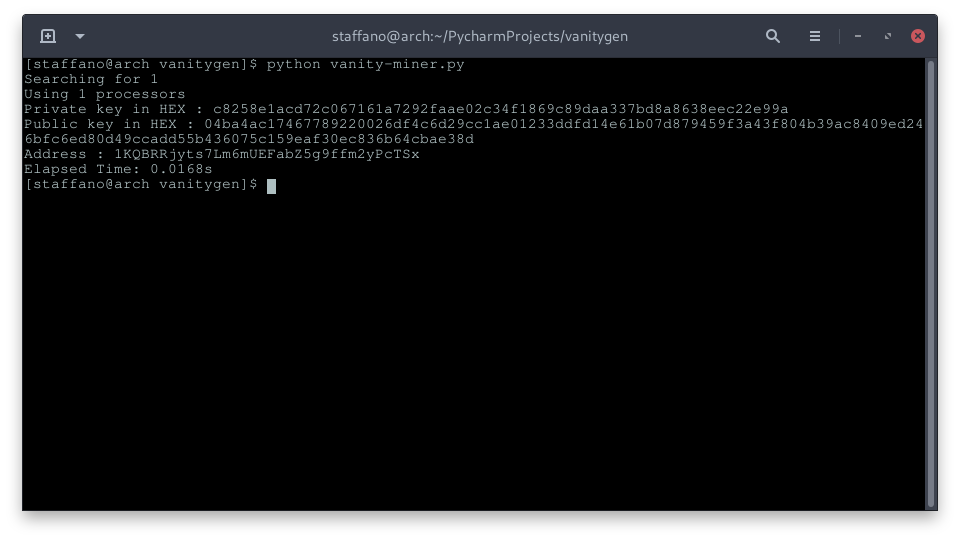
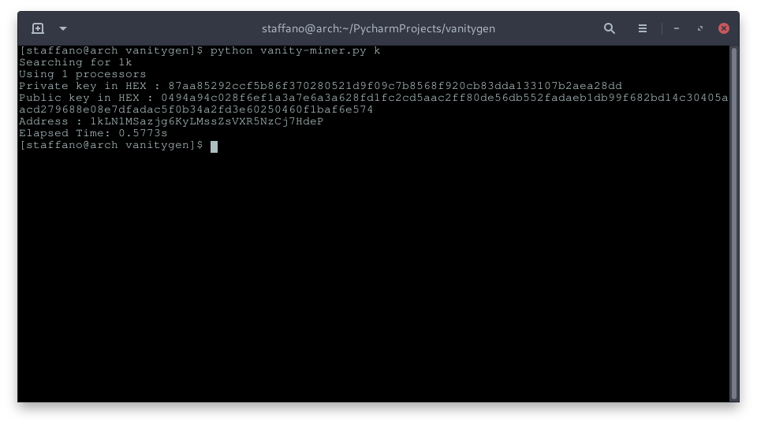
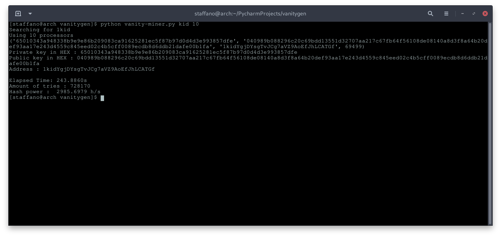

# Vanity Miner

## Note
* This program **will stress** all provided cores to the maximum, if you provide all cores your computer might become unresponsive
* It could also deal **fatal** damage to your CPU, so be careful when using it

## Requirements

* Python 3.X

## Packages

* bitcoin (by  vbuterin)

## Overview

* This is just a simple implementation of a vanity miner for bitcoin addresses
* A vanity address is an address that starts with a user specified pattern of characters

* For example an address with the prefix **1kid**:
> 1kidTuqUu3sFzg5FgnQPPZDChN2qzdx1B

* The only way to get a vanity address is by trial and error

## How it works

* As mentioned earlier the only way to get a vanity address is by **brute-force**
* The script generates a private key, derives a public key from it, then further derives an address from the public key
* It then checks the newly generated address with the given pattern, if it matches you will receive the private key, public key and vanity address
* If however the new address doesn't match our pattern, it will generate another set of private key, public key  and address until it matches

## Usage

* The script works with system arguments
* You can specify the pattern to look for in the first argument
* And the amount of cpu cores to look for it in the second argument

## Examples

**Without arguments**

**Only with Pattern**

**Pattern and CPU count**

